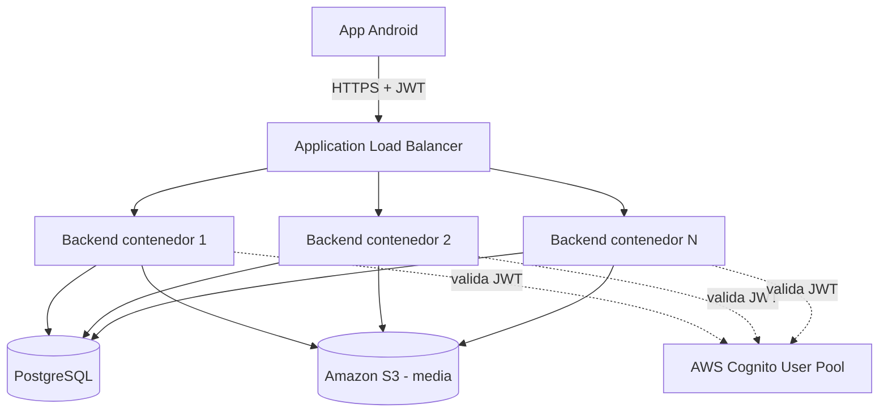

# Arquitectura de nube — SpotsApp

## 1. Diagrama de infraestructura

```
                    ┌─────────────────────┐
                    │   App Android       │
                    │ (Kotlin/Compose)    │
                    └──────────┬──────────┘
                               │ HTTPS (JWT en header Authorization)
                               ▼
                    ┌─────────────────────┐
                    │  Application Load   │
                    │  Balancer (ALB)     │
                    └──────────┬──────────┘
                               │ round-robin / health checks
              ┌────────────────┼────────────────┐
              ▼                ▼                ▼
      ┌───────────────┐ ┌───────────────┐ ┌───────────────┐
      │ Backend        │ │ Backend        │ │ Backend        │   <- N contenedores idénticos
      │ (Spring Boot,   │ │ (Spring Boot,   │ │ (Spring Boot,   │      (mismo Docker image),
      │  contenedor)    │ │  contenedor)    │ │  contenedor)    │      stateless (RNF-02)
      └───────┬────────┘ └───────┬────────┘ └───────┬────────┘
              │                  │                  │
              └────────┬─────────┴─────────┬────────┘
                        ▼                   ▼
              ┌──────────────────┐  ┌──────────────────┐
              │   PostgreSQL      │  │   Amazon S3        │
              │  (RDS o contenedor│  │  (media: fotos/     │
              │   con volumen     │  │   videos, vía        │
              │   persistente)    │  │   presigned URL,     │
              │                   │  │   ADR-001)            │
              └──────────────────┘  └──────────────────┘

                        ▲
                        │ valida el JWT (issuer-uri / JWKS)
                        │
              ┌──────────────────┐
              │   AWS Cognito     │
              │  (User Pool: auth │
              │  + grupos ADMIN/  │
              │  USER)            │
              └──────────────────┘
```

Diagrama equivalente en Mermaid (para quien prefiera renderizarlo):



### Notas sobre el diagrama

- **Stateless (RNF-02):** el backend no guarda sesión ni estado local — cualquier instancia
  puede atender cualquier request, porque toda la identidad viaja en el JWT (ver `SecurityConfig`,
  Fase 6). Esto es lo que hace posible tener N contenedores detrás del ALB sin *sticky sessions*.
- **Sin FK a Cognito (ADR-002):** el backend valida el JWT contra el `issuer-uri` de Cognito
  (JWKS), pero no llama a Cognito en cada request para "leer" el usuario — el propio JWT ya trae
  `username` y `cognito:groups` firmados.
- **Media nunca pasa por el backend (ADR-001):** el cliente sube el binario directo a S3 con la
  URL prefirmada; el backend solo genera esa URL y registra la URL final. Esto evita que el
  tráfico de fotos/videos consuma CPU/memoria de los contenedores del backend.
- **Un solo Dockerfile, N réplicas:** el mismo build multi-stage (Fase 8, Paso 8.1) es la unidad
  de despliegue; escalar significa correr más contenedores de esa misma imagen, no builds distintos.

## 2. Escalamiento vertical vs. horizontal

| | **Vertical (scale up)** | **Horizontal (scale out)** |
|---|---|---|
| **Qué se hace** | Darle más CPU/RAM a la *misma* instancia/contenedor | Correr *más* instancias/contenedores idénticos detrás del ALB |
| **Límite** | Tiene techo físico (el tamaño de instancia más grande disponible) | Prácticamente sin techo — se agregan réplicas según demanda |
| **Downtime al escalar** | Normalmente requiere reiniciar la instancia (downtime o al menos un blip) | Ninguno — se agregan/quitan contenedores sin tocar los existentes |
| **Punto único de falla** | Sí — si esa instancia cae, cae todo el servicio | No — el ALB deja de enviar tráfico al contenedor que falla y sigue con el resto |
| **Requisito de diseño** | Ninguno especial | La app debe ser **stateless** (por eso importa RNF-02 y ADR-002 en este proyecto) |
| **Costo** | Suele ser más caro por unidad de recurso en instancias grandes | Más eficiente en costo — se paga por lo que se usa, se apagan réplicas en horas valle |
| **Encaja mejor con** | Cargas predecibles, apps con estado en memoria difíciles de distribuir | Tráfico variable/impredecible (picos de uso), microservicios stateless — el caso de SpotsApp |

**Por qué SpotsApp está diseñado para horizontal:** al no guardar sesión ni estado en memoria
(JWT stateless, sin caché local de datos de usuario), cualquier contenedor puede atender cualquier
request. Eso permite escalar horizontalmente sin cambios de código — solo se ajusta cuántas
réplicas corren detrás del ALB. La base de datos (PostgreSQL) sigue siendo el recurso compartido
que hay que escalar aparte (verticalmente, o con réplicas de lectura) porque sí mantiene estado.

## 4. Despliegue real usado en este proyecto: EC2 standalone (plan gratuito)

El diagrama de las secciones 1-3 es la arquitectura **objetivo/conceptual** (la que se
implementaría con presupuesto y un dominio propio). Para la sustentación de este proyecto se
usa una versión de **un solo nodo** de ese mismo diagrama, por dos restricciones concretas:

1. **Plan gratuito de AWS**: no hay presupuesto para un ALB (tiene costo por hora + por LCU) ni
   para RDS administrado a tiempo completo.
2. **Sin dominio propio**: sin dominio no hay certificado TLS gestionado (ACM se emite para un
   dominio), así que no tiene sentido pagar un ALB solo para terminar TLS.

Lo que se despliega en la práctica:

```
┌─────────────────────────────────────────────────────────┐
│  EC2 (t2.micro / t3.micro — free tier), 1 IP elástica     │
│                                                            │
│   ┌──────────────┐        ┌──────────────┐                │
│   │  Contenedor   │        │  Contenedor   │                │
│   │  backend      │◄──────►│  db           │                │
│   │  (Spring Boot)│  red   │  (PostgreSQL) │                │
│   │  puerto 8080  │ docker │  puerto 5432  │                │
│   └───────┬───────┘        │  (solo interno)│               │
│           │                └──────────────┘                │
└───────────┼───────────────────────────────────────────────┘
            │ HTTP directo a la IP:8080 (sin ALB, sin dominio)
            ▼
     App Android (BASE_URL = http://<IP_ELASTICA>:8080/)

  (Cognito y S3 siguen siendo servicios administrados de AWS, fuera de la instancia,
   igual que en el diagrama de la sección 1 — la única diferencia es cómo se llega
   al backend)
```

Esto es exactamente `docker-compose.yml` (sección 3) corriendo dentro de una única instancia
EC2 en vez de en la laptop de desarrollo — **ninguna** línea de ese archivo cambia entre "local"
y "EC2"; lo único que cambia es *dónde* corre `docker-compose up` y las variables de entorno
reales del `.env` (Cognito issuer, bucket S3). El runbook paso a paso está en
[`despliegue-ec2.md`](./despliegue-ec2.md).

### Qué NO tiene este despliegue (a propósito) y por qué

- **No hay ALB ni múltiples contenedores de backend** → no hay escalamiento horizontal real en
  este despliegue: hay un único punto de falla (la instancia EC2). Esto es aceptable para una
  demo/sustentación, y es justamente el contraste útil con la sección 2: si este proyecto tuviera
  que crecer a producción con tráfico real, el camino natural es exactamente el diagrama de la
  sección 1 (agregar el ALB delante y correr N contenedores backend idénticos) — no reescribir
  nada, porque el backend ya es stateless (RNF-02, ADR-002).
- **No hay HTTPS** → el tráfico entre la app y el backend va por HTTP plano contra la IP pública.
  Se documenta y se acota explícitamente en el cliente (`network_security_config.xml` en
  `/mobile`, que permite cleartext *solo* hacia esa IP, no hacia cualquier host) precisamente
  para dejar constancia de que es una limitación conocida del entorno gratuito/sin dominio, no un
  descuido.
- **Credenciales AWS**: la instancia usa un **IAM Role** adjunto (no `AWS_ACCESS_KEY_ID`/
  `AWS_SECRET_ACCESS_KEY` estáticas en el `.env`) — `S3Config` ya resuelve credenciales con la
  cadena por defecto del SDK, así que un Role con permisos `s3:PutObject`/`s3:GetObject` acotados
  al bucket es todo lo que hace falta (ver `despliegue-ec2.md`, paso de IAM).
